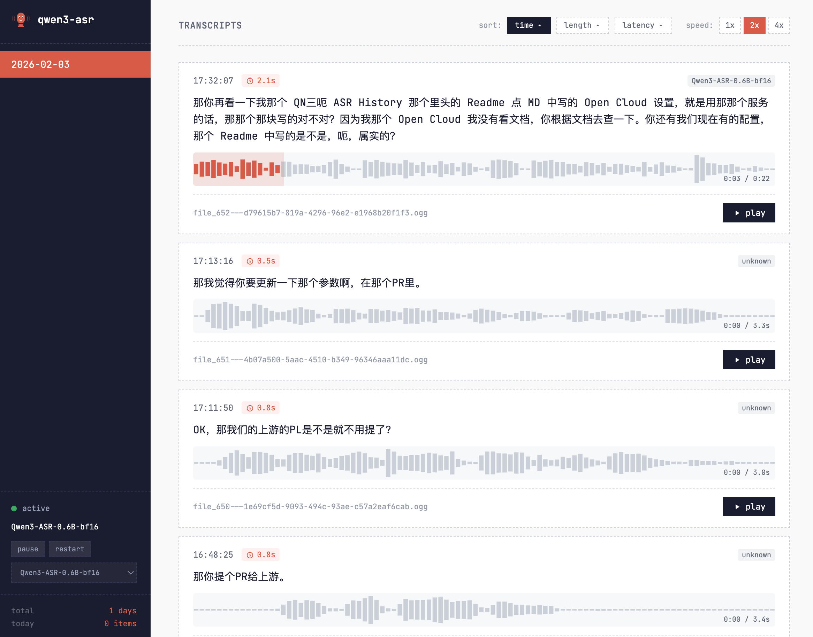

#  MLS

**MLX Local Serving** - unified local inference for ASR, TTS, Translation, Image Generation, and Vision on Apple Silicon. All five models run on Metal GPU via MLX and stay resident in memory.



## Quick Start

```bash
git clone https://github.com/hanxiao/mls ~/Documents/mls
cd ~/Documents/mls
uv sync
uv run bin/server.py
# http://127.0.0.1:18321
```

Dashboard at `http://127.0.0.1:18321/history`

## Models

| Service | Model | Size |
|---------|-------|------|
| ASR | Qwen3-ASR-1.7B-8bit | 1.7 GB |
| TTS | Qwen3-TTS-12Hz-1.7B-VoiceDesign-bf16 | 3.6 GB |
| Translate | TranslateGemma-12B-8bit | 12 GB |
| Image | Z-Image-Turbo-8bit (mflux) | 10 GB |
| Vision | jina-vlm-mlx (4-bit) | 2 GB |

## API

### Health Check
```bash
curl http://127.0.0.1:18321/health
```

### ASR (Speech-to-Text)
```bash
curl -X POST http://127.0.0.1:18321/transcribe \
  -H "Content-Type: application/json" \
  -d '{"path": "/path/to/audio.ogg", "language": "zh"}'
# -> {"text": "...", "latency_ms": 1234}
```

### TTS (Text-to-Speech)
```bash
curl -X POST http://127.0.0.1:18321/synthesize \
  -H "Content-Type: application/json" \
  -d '{
    "text": "Hello world",
    "language": "english",
    "format": "ogg",
    "instruct": "A young male speaker with a calm tone"
  }'
# -> {"audio_url": "/tts_audio/tts_xxx.ogg", "latency_ms": 3400, "audio_duration_ms": 6000}
```

### Translate
```bash
curl -X POST http://127.0.0.1:18321/translate \
  -H "Content-Type: application/json" \
  -d '{"q": "Hello world", "source": "en", "target": "zh"}'
# -> {"data": {"translations": [{"translatedText": "..."}]}}
```

Supports 70+ languages. `GET /languages` for the full list.

### Image Generation
```bash
curl -X POST http://127.0.0.1:18321/api/image/generate \
  -H "Content-Type: application/json" \
  -d '{"prompt": "a pixel art cat", "steps": 9}'
# -> {"image_url": "/image_output/img_xxx.png", "latency_ms": 28000}
```

### Vision (Image Understanding)
```bash
curl -X POST http://127.0.0.1:18321/api/vision/analyze \
  -H "Content-Type: application/json" \
  -d '{"image": "/path/to/image.png", "prompt": "Describe this image.", "max_tokens": 512}'
# -> {"response": "...", "latency_ms": 2100}
```

Upload images via `POST /api/vision/upload` (multipart form).

## Dashboard

Three-column layout: sidebar (services, GPU/disk/USB stats, log chart, theme toggle) | history | compose panel.

- Per-service pause/resume/restart controls
- Calendar-based history navigation with sortable columns
- Real-time GPU utilization, memory, disk, and USB monitoring
- Live server log streaming
- Light/dark/auto theme

## OpenClaw Integration

Copy `skills/SKILL.md` to your OpenClaw workspace:

```bash
cp skills/SKILL.md ~/.openclaw/workspace/skills/local-model/SKILL.md
```

For automatic voice message transcription, add the ASR wrapper to `openclaw.json`:

```json
{
  "tools": {
    "media": {
      "audio": {
        "enabled": true,
        "models": [
          {
            "type": "cli",
            "command": "~/Documents/mls/bin/qwen3-asr",
            "args": ["{{MediaPath}}"],
            "timeoutSeconds": 60
          }
        ]
      }
    }
  }
}
```

## Requirements

- macOS 14+ with Apple Silicon
- Python 3.12+
- `uv` package manager
- `ffmpeg` and `ffprobe` (for audio conversion)
