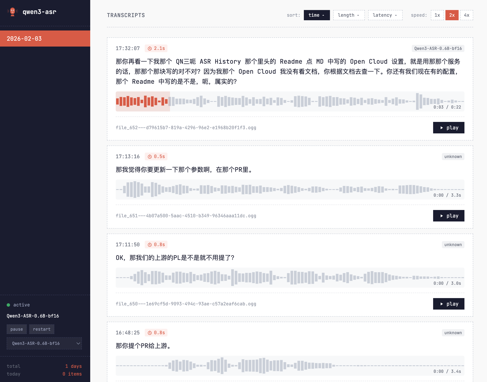

#  MLS

**MLX Local Serving** - unified local inference for ASR, TTS, Translation, Image Generation, Vision, and Embeddings on Apple Silicon. All six models run on Metal GPU via MLX and stay resident in memory.



## Quick Start

```bash
git clone https://github.com/hanxiao/mls ~/Documents/mls
cd ~/Documents/mls
uv sync
uv run bin/server.py
# http://127.0.0.1:18321
```

Dashboard at `http://127.0.0.1:18321/` (also available at `/history`)

## Models

| Service | Model | Size |
|---------|-------|------|
| ASR | Qwen3-ASR-1.7B-8bit | 1.7 GB |
| TTS | Qwen3-TTS-12Hz-1.7B-VoiceDesign-bf16 | 3.6 GB |
| Translate | TranslateGemma-12B-8bit | 12 GB |
| Image | Z-Image-Turbo-8bit (mflux) | 10 GB |
| Vision | jina-vlm-mlx (4-bit) | 2 GB |
| Embedding | jina-embeddings-v5-omni-small-mlx | ~3 GB |

## API

### Health Check
```bash
curl http://127.0.0.1:18321/health
```

### ASR (Speech-to-Text)
```bash
curl -X POST http://127.0.0.1:18321/transcribe \
  -H "Content-Type: application/json" \
  -d '{"path": "/path/to/audio.ogg", "language": "zh"}'
# -> {"text": "...", "latency_ms": 1234}
```

### TTS (Text-to-Speech)
```bash
curl -X POST http://127.0.0.1:18321/synthesize \
  -H "Content-Type: application/json" \
  -d '{
    "text": "Hello world",
    "language": "english",
    "format": "ogg",
    "instruct": "A young male speaker with a calm tone"
  }'
# -> {"audio_url": "/tts_audio/tts_xxx.ogg", "latency_ms": 3400, "audio_duration_ms": 6000}
```

### Translate
```bash
curl -X POST http://127.0.0.1:18321/translate \
  -H "Content-Type: application/json" \
  -d '{"q": "Hello world", "source": "en", "target": "zh"}'
# -> {"data": {"translations": [{"translatedText": "..."}]}}
```

Supports 70+ languages. `GET /languages` for the full list.

### Image Generation
```bash
curl -X POST http://127.0.0.1:18321/api/image/generate \
  -H "Content-Type: application/json" \
  -d '{"prompt": "a pixel art cat", "steps": 9}'
# -> {"image_url": "/image_output/img_xxx.png", "latency_ms": 28000}
```

### Vision (OpenAI-compatible)

Drop-in replacement for OpenAI's multimodal chat completions. Works with any client that supports the OpenAI API (LangChain, OpenAI SDK, LiteLLM, etc).

```bash
# base64 image
curl -X POST http://127.0.0.1:18321/v1/chat/completions \
  -H "Content-Type: application/json" \
  -d '{
    "model": "jinaai/jina-vlm-mlx",
    "messages": [
      {"role": "user", "content": [
        {"type": "text", "text": "Describe this image."},
        {"type": "image_url", "image_url": {"url": "data:image/png;base64,iVBOR..."}}
      ]}
    ],
    "max_tokens": 512
  }'

# local file path
curl -X POST http://127.0.0.1:18321/v1/chat/completions \
  -H "Content-Type: application/json" \
  -d '{
    "model": "jinaai/jina-vlm-mlx",
    "messages": [
      {"role": "user", "content": [
        {"type": "text", "text": "What is in this image?"},
        {"type": "image_url", "image_url": {"url": "/path/to/image.png"}}
      ]}
    ]
  }'
```

`GET /v1/models` lists loaded models. Upload images via `POST /api/vision/upload` (multipart form).

### Embedding (OpenAI-compatible)

Drop-in replacement for OpenAI's `/v1/embeddings`. Returns L2-normalized vectors (1024-dim, Matryoshka). Works with any OpenAI client and serves as the memory-search embedder for OpenClaw.

```bash
curl -X POST http://127.0.0.1:18321/v1/embeddings \
  -H "Content-Type: application/json" \
  -d '{
    "model": "jina-embeddings-v5-omni-small",
    "input": ["the quick brown fox", "lorem ipsum"],
    "input_type": "retrieval.passage",
    "dimensions": 256
  }'
# -> {"object": "list", "data": [{"object": "embedding", "index": 0, "embedding": [...]}], ...}
```

`input_type` selects the task and prefix: `retrieval.query`, `retrieval.passage`, `text-matching`, `clustering`, `classification` (default `retrieval.passage`). `dimensions` truncates to a Matryoshka size (32, 64, 128, 256, 512, 1024).

Native endpoint:
```bash
curl -X POST http://127.0.0.1:18321/embed \
  -H "Content-Type: application/json" \
  -d '{"input": ["hello world"], "input_type": "retrieval.query", "dimensions": 1024}'
```

## Dashboard

Three-column layout: sidebar (services, GPU/disk/USB/queue stats, log chart, theme toggle) | history | compose panel.

- Per-service pause/resume/restart controls
- Calendar-based history navigation with bidirectional sort
- Real-time GPU utilization, memory, disk, USB, and inference queue monitoring
- Live server log streaming (SSE)
- New-item flash notification on sidebar service rows
- Light/dark/auto theme

## OpenClaw Integration

Copy `skills/SKILL.md` to your OpenClaw workspace:

```bash
cp skills/SKILL.md ~/.openclaw/workspace/skills/local-model/SKILL.md
```

For automatic voice message transcription, add the ASR wrapper to `openclaw.json`:

```json
{
  "tools": {
    "media": {
      "audio": {
        "enabled": true,
        "models": [
          {
            "type": "cli",
            "command": "~/Documents/mls/bin/qwen3-asr",
            "args": ["{{MediaPath}}"],
            "timeoutSeconds": 60
          }
        ]
      }
    }
  }
}
```

### Memory backend (embeddings)

mls exposes an OpenAI-compatible embeddings endpoint that OpenClaw can use as its memory-search embedder. Point `agents.defaults.memorySearch` at it in `~/.openclaw/openclaw.json`:

```json
{
  "agents": {
    "defaults": {
      "memorySearch": {
        "provider": "openai",
        "model": "jina-embeddings-v5-omni-small",
        "remote": {
          "baseUrl": "http://127.0.0.1:18321/v1",
          "apiKey": "local-mls"
        },
        "queryInputType": "retrieval.query",
        "documentInputType": "retrieval.passage"
      }
    }
  }
}
```

Switching embedders requires a memory reindex. Set `dimensions` on the request for Matryoshka truncation (32, 64, 128, 256, 512, 1024) if you want smaller vectors.

## Requirements

- macOS 14+ with Apple Silicon
- Python 3.12+
- `uv` package manager
- `ffmpeg` and `ffprobe` (for audio conversion)
